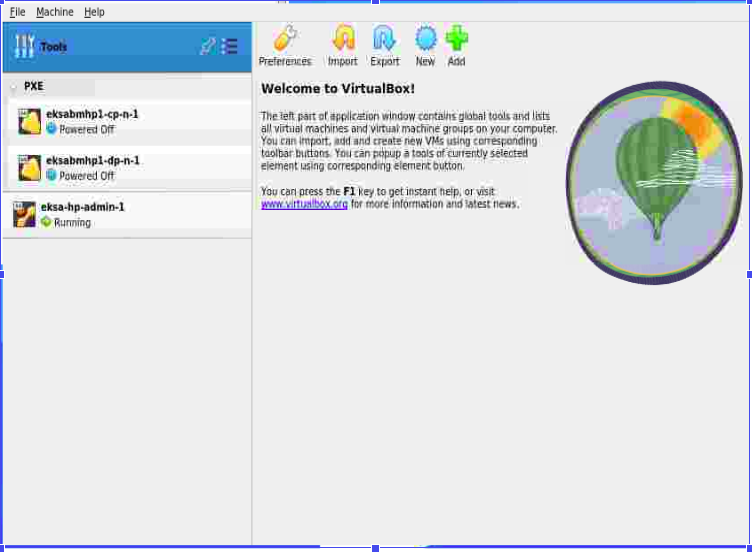
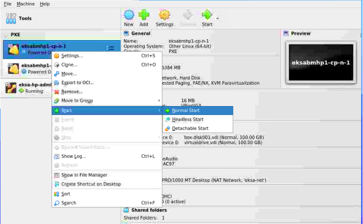
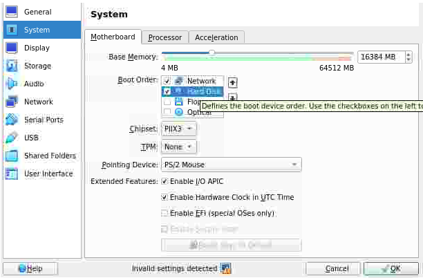

# Steps to create an AWS EKS Anywhere bare metal Kubernetes cluster

In order to test the working of AWS EKSA, we will require some setup.
Below are the steps the achieve the same either manually or with the help of scripts.

## Manually setting up infra

Before creating the AWS EKS Anywhere bare metal Kubernetes cluster, you need to ensure that you have a few prerequisites in place. These includes: 
1. Ensuring that your hardwares is in place that meets the minimum requirements. We are going to need a minimum of 3 machines (VMs in case of virtual box). One VM as ‘admin’ or ‘bootstrap’ node, one VM as ‘control-plane’ node and finally one as ‘worker’ node. 
2. A [NATNETWORK](https://github.com/infracloudio/aws-eksa-setup/blob/master/scripts/vm-scripts/create-network.sh) needs to be created that joins all the 3 VMs as well as the host VM.
3. For ‘admin’ machines, minimum configurations are: 4 CPU cores, 16 GB memory, 30 GB free disk space, administrative machines must be on the same Layer 2 network as the cluster machines, Docker 20.x.x, and Ubuntu 20.04.2 LTS. ‘Admin’ VM needs to have ‘Ubuntu’ OS installed. Even though in [official documentation](https://anywhere.eks.amazonaws.com/docs/getting-started/baremetal/bare-prereq/#compute-server-requirements), the above hardware configuration for ‘admin’ VM has been mentioned as given, we can use [slightly lower](https://github.com/infracloudio/aws-eksa-setup/blob/b648c803a30c304504b4db923771306647300985/scripts/vm-scripts/Vagrantfile#L18-L19) resources. Also tools that need to be installed in the admin VM (the Ubuntu based VM) are eksctl, kubectl, anywhere, docker.
4. The cluster VMs (control-plane and worker) need to be iPXE enabled. The [official documentation](https://anywhere.eks.amazonaws.com/docs/getting-started/baremetal/bare-prereq/#compute-server-requirements) states they need to have 8 GB RAM, 2 CPU and 25 GB storage. Here as well we shall configure [lower resources](https://github.com/infracloudio/aws-eksa-setup/blob/b648c803a30c304504b4db923771306647300985/scripts/vm-scripts/Vagrantfile#L36-L37).



## Automated way of setting up infra

These [scripts](https://github.com/infracloudio/aws-eksa-setup/tree/master/scripts/aws-tf) helps us to automate the setting up of the infra process in AWS cloud provider.

These scripts help to :
1. Create an [EC2 instance](https://github.com/infracloudio/aws-eksa-setup/blob/b648c803a30c304504b4db923771306647300985/scripts/aws-tf/main.tf#L37) based on Ubuntu 20.04 LTS AMI that will act as a bootstrap node. We have chosen ‘z1d.metal’ since virtualbox can only run this particular instance type.
2. Create an [admin VM](https://github.com/infracloudio/aws-eksa-setup/blob/b648c803a30c304504b4db923771306647300985/scripts/aws-tf/main.tf#L69) on which `eksctl` commands would be run, also it will host the local kind cluster.
3. Create a [NATNETWORK](https://github.com/infracloudio/aws-eksa-setup/blob/b648c803a30c304504b4db923771306647300985/scripts/aws-tf/main.tf#L68C1-L68C1) for bootstrap/admin VM  CP node and DP node to communicate also reachable to the internet.
4. Create PXE enabled [CP and DP nodes/VMs](https://github.com/infracloudio/aws-eksa-setup/blob/b648c803a30c304504b4db923771306647300985/scripts/aws-tf/main.tf#L70).
5. Create 2 security groups: to [allow ssh](https://github.com/infracloudio/aws-eksa-setup/blob/b648c803a30c304504b4db923771306647300985/scripts/aws-tf/main.tf#L5) into the instance, to [allow traffic](https://github.com/infracloudio/aws-eksa-setup/blob/b648c803a30c304504b4db923771306647300985/scripts/aws-tf/main.tf#L21) to the internet. 

Below commands needs to be run in order to setup the infrastructure:
```bash
# clone the repo
cd eksa-setup/scripts/aws-tf
terraform init
terraform apply –auto-approve
```

Before running the above commands, ensure that the `pem` certificates are available at the location specified in scripts in order to connect to AWS. Also we can skip steps 4, 5 & 6 because the tools would be configured as a part of this. Setting up this infra will incur costs so this can be destroyed with command `terraform destroy --auto-approve` as soon as usage is over.

## Setup kubernetes cluster using AWS EKSA on your infra

Post setting up of infra either manually or via scripts, we can proceed to create cluster on the bare metals using AWS EKSA.

1. SSH into the `admin` VM and enter sudo mode.
```bash
vagrant ssh eksa-hp-admin-1

sudo su -
```
2. Install [docker & kubectl](https://github.com/infracloudio/aws-eksa-setup/blob/b648c803a30c304504b4db923771306647300985/scripts/vm-scripts/configure-admin.sh#L6-L13) in ‘admin’ VM.
3. Install the [EKS Anywhere CLI](https://github.com/infracloudio/aws-eksa-setup/blob/b648c803a30c304504b4db923771306647300985/scripts/vm-scripts/configure-admin.sh#L15-L28) in ‘admin’ VM in order to create and manage your EKS Anywhere clusters.
4. Steps #2 and #3 needs to be performed by [mounting](https://github.com/infracloudio/aws-eksa-setup/blob/b648c803a30c304504b4db923771306647300985/scripts/vm-scripts/Vagrantfile#L28) a shell script containing commands to install tools (docker, kubectl, eks anywhere) in the ‘admin’ VM. Th5. is mounting is required only in case of manual infra setup.
5. Use the EKS Anywhere CLI to generate a cluster configuration file. This file contains the necessary information about your cluster, such as the name of the cluster, the Kubernetes version you want to use, and the number of nodes you want to create.
```bash
export CLUSTER_NAME=mgmt

eksctl anywhere generate clusterconfig $CLUSTER_NAME --provider tinkerbell > eksa-mgmt-cluster.yaml
```

6. Edit the generated config file `eksa-mgmt-cluster.yaml` and update below fields:
    - `Cluster.controlPlaneConfiguration.endpoint.host` - insert an available IP within the hosts cidr range. Refer to the prerequisite section.
    - `TinkerbellDatacenterConfig.spec.tinkerbellIP` - insert an available IP within the hosts cidr range. Refer to the prerequisite section.
    - `TinkerbellMachineConfig.spec.users.#.sshAuthorizedKeys` - insert the ssh keys. Refer to the prerequisite section.
    - `TinkerbellMachineConfig` objects. Two objects because one for control-plane and another for worker node group.
    - `TinkerbellMachineConfig.spec.hardwareSelector` - Provide an appropriate hardware selector that should match the labels of the hardware csv files.  to be used to recognize either a control plane node or work node group. This acts as a `matchLabels` in kubernetes terms.

The final cluster config will look like [this](https://github.com/infracloudio/aws-eksa-setup/blob/master/dist/cluster-config.yaml).

7. After you have generated the cluster configuration file, create a `hardware.csv` file that contains certain information about the bare metal machines that need to be part of the cluster. The format of the csv should be as below:
```csv
hostname,mac,ip_address,netmask,gateway,nameservers,labels,disk,bmc_ip,bmc_username,bmc_password
eksabmhp1-cp-n-1,08:00:27:84:69:68,192.168.10.88,255.255.255.0,192.168.10.1,8.8.8.8,type=cp,/dev/sda,,,
eksabmhp1-dp-n-1,08:00:27:82:07:72,192.168.10.194,255.255.255.0,192.168.10.1,8.8.8.8,type=dp,/dev/sda,,,
```

8. Initiate cluster provisioning: Use `eksctl anywhere` cli tool to create/provision cluster.
```bash
eksctl anywhere create cluster --hardware-csv hardware.csv -f eksa-mgmt-cluster.yaml
```
Note: use `-v 9` to increase the verbosity of the logs. Levels can range from 1 to 9.

9. Now we have to monitor the progress and keep an eye on the logs as an indication on when to start/restart VMs (if BMC details have not been provided).

10. First step of monitoring is to wait for the log `Installing cluster-api providers on bootstrap cluster` and for the `boots` container to come up for at least 1 min (wait for 1 min because, boots container acts as DHCP server for the control-plane and worker nodes hence it takes some time to register the hardware details sent via `hardware.csv`). Open another terminal and ssh into admin VM in order to execute debug commands because the above cluster create command will block the terminal.

```bash
docker ps -a
CONTAINER ID   IMAGE                                                                                   COMMAND                  CREATED              STATUS              PORTS
                                                                        NAMES
2fe2736be500   public.ecr.aws/eks-anywhere/tinkerbell/boots:v0.8.1-eks-a-36                            "/usr/bin/boots -kub…"   About a minute ago   Up About a minute
                                                                        boots
de17645f37aa   public.ecr.aws/eks-anywhere/kubernetes-sigs/kind/node:v1.22.17-eks-d-1-22-24-eks-a-36   "/usr/local/bin/entr…"   3 minutes ago        Up 2 minutes        0.0.0.0:42113->42113/tcp, 0.0.0.0:
50051->50051/tcp, 0.0.0.0:50061->50061/tcp, 127.0.0.1:32785->6443/tcp   mgmt-eks-a-cluster-control-plane
2aed91428827   public.ecr.aws/eks-anywhere/cli-tools:v0.15.2-eks-a-36                                  "sleep infinity"         4 minutes ago        Up 4 minutes
                                                                        eksa_1684839508178736971
```

11. Also keep monitoring the logs in first terminal, it should look something like:
```bash
eksctl anywhere create cluster –hardware-csv hardware.csv -f eksa-mgmt-cluster.yaml

Warning: The recommended number of control plane nodes is 3 or 5
Warning: The recommended number of control plane nodes is 3 or 5
Performing setup and validations
✅ Tinkerbell Provider setup is valid
✅ Validate OS is compatible with registry mirror configuration
✅ Validate certificate for registry mirror
✅ Validate authentication for git provider
Creating new bootstrap cluster
Provider specific pre-capi-install-setup on bootstrap cluster
Installing cluster-api providers on bootstrap cluster
Provider specific post-setup
Creating new workload cluster
```

Once the above log `Creating new workload cluster` has appeared and `boots` container is up for 1 minute, power on the control plane node (eksabmhp1-cp-n-1).



12. The control plane node will now boot via network (or called as DHCP booting) and `boots` container will serve necessary `initramfs` and `vmlinuz` files. You can check the logs of the `boots` container to check the proceedings.
```bash
docker logs boots
```

13. At this point of time a local kind cluster config would have been created in the `admin` machine. Its kube-config file would have been located at `<cluster-name>/<generated>` directory. In our case it would be `mgmt/generated/mgmt.kind.kubeconfig`.

14. Use the above kube-config to monitor machine status and workflow status.
```bash
export KUBECONFIG=mgmt/generated/mgmt.kind.kubeconfig

kubectl get machines.cluster.x-k8s.io -n eksa-system
NAMESPACE     NAME                         CLUSTER   NODENAME   PROVIDERID   PHASE          AGE     VERSION
eksa-system   mgmt-md-0-6879f6cbc5-56sk2   mgmt                              Pending        3m29s   v1.22.17-eks-1-22-24
eksa-system   mgmt-tfqbs                   mgmt                              Provisioning   3m27s   v1.22.17-eks-1-22-24


kubectl get workflow -n eksa-system
NAMESPACE     NAME                                              TEMPLATE                                          STATE
eksa-system   mgmt-control-plane-template-1684839806667-tsj4f   mgmt-control-plane-template-1684839806667-tsj4f   STATE_RUNNING
```

15. The machine phase changes from `Pending` -> `Provisioning` -> `Provisioned` -> `Running`. When it is in the `Running` phase, the kubelet is running in it and the machine is now part of the cluster.

```bash
kubectl get machines.cluster.x-k8s.io -n eksa-system
NAMESPACE     NAME                         CLUSTER   NODENAME   PROVIDERID                                  PHASE         AGE     VERSION
eksa-system   mgmt-md-0-6879f6cbc5-56sk2   mgmt                                                             Pending       7m11s   v1.22.17-eks-1-22-24
eksa-system   mgmt-tfqbs                   mgmt                 tinkerbell://eksa-system/eksabmhp1-cp-n-1   Provisioned   7m9s    v1.22.17-eks-1-22-24
```

NOTE: In case of `virtualbox`, when in the `Provisioned` phase the machine restarts because of the last action of the workflow, but the boot order does not change from `Network` to `Hard Disk`. This has to be done manually as shown in the image. This is platform specific and does not replicate in other platforms like `equinix`.



16. When the machine phase changes to `Running` for control plane node(s), start the worker node group machines in the same way. A new workflow gets injected into the cluster CRDs which runs on the worker node group node(s).

```bash
kubectl get machines.cluster.x-k8s.io -n eksa-system
NAMESPACE     NAME                         CLUSTER   NODENAME     PROVIDERID                                  PHASE          AGE     VERSION
eksa-system   mgmt-md-0-6879f6cbc5-56sk2   mgmt                                                               Provisioning   9m40s   v1.22.17-eks-1-22-24
eksa-system   mgmt-tfqbs                   mgmt      mgmt-tfqbs   tinkerbell://eksa-system/eksabmhp1-cp-n-1   Running        9m38s   v1.22.17-eks-1-22-24
```

```bash
kubectl get workflow -n eksa-system
NAMESPACE     NAME                                              TEMPLATE                                          STATE
eksa-system   mgmt-control-plane-template-1684839806667-tsj4f   mgmt-control-plane-template-1684839806667-tsj4f   STATE_SUCCESS
eksa-system   mgmt-md-0-1684839806668-9ggml                     mgmt-md-0-1684839806668-9ggml                     STATE_PENDING
```

17. Wait for the worker machine’s phase change to `Provisioned` and then change boot order for this as well and restart the machine.

```bash
kubectl get machines.cluster.x-k8s.io -n eksa-system
NAMESPACE     NAME                         CLUSTER   NODENAME     PROVIDERID                                  PHASE         AGE   VERSION
eksa-system   mgmt-md-0-6879f6cbc5-56sk2   mgmt                   tinkerbell://eksa-system/eksabmhp1-dp-n-1   Provisioned   14m   v1.22.17-eks-1-22-24
eksa-system   mgmt-tfqbs                   mgmt      mgmt-tfqbs   tinkerbell://eksa-system/eksabmhp1-cp-n-1   Running       14m   v1.22.17-eks-1-22-24
```

18. Wait for the worker machine’s phase change to `Running`.

```bash
kubectl get machines.cluster.x-k8s.io -n eksa-system
NAMESPACE     NAME                         CLUSTER   NODENAME                     PROVIDERID                                  PHASE     AGE   VERSION
eksa-system   mgmt-md-0-6879f6cbc5-56sk2   mgmt      mgmt-md-0-6879f6cbc5-56sk2   tinkerbell://eksa-system/eksabmhp1-dp-n-1   Running   16m   v1.22.17-eks-1-22-24
eksa-system   mgmt-tfqbs                   mgmt      mgmt-tfqbs                   tinkerbell://eksa-system/eksabmhp1-cp-n-1   Running   16m   v1.22.17-eks-1-22-24
```

19. Now the `eksctl anywhere` starts moving the kind cluster from the `admin` machine to `control plane` node(s). The final logs would look like this:

```
Warning: The recommended number of control plane nodes is 3 or 5
Warning: The recommended number of control plane nodes is 3 or 5
Performing setup and validations
✅ Tinkerbell Provider setup is valid
✅ Validate certificate for registry mirror
✅ Validate authentication for git provider
✅ Create preflight validations pass
Creating new bootstrap cluster
Provider specific pre-capi-install-setup on bootstrap cluster
Installing cluster-api providers on bootstrap cluster
Provider specific post-setup
Creating new workload cluster
Installing networking on workload cluster
Creating EKS-A namespace
Installing cluster-api providers on workload cluster
Installing EKS-A secrets on workload cluster
Installing resources on management cluster
Moving cluster management from bootstrap to workload cluster
Installing EKS-A custom components (CRD and controller) on workload cluster
Installing EKS-D components on workload cluster
Creating EKS-A CRDs instances on workload cluster
Installing GitOps Toolkit on workload cluster
GitOps field not specified, bootstrap flux skipped
Writing cluster config file
Deleting bootstrap cluster
🎉 Cluster created!
--------------------------------------------------------------------------------------
The Amazon EKS Anywhere Curated Packages are only available to customers with the
Amazon EKS Anywhere Enterprise Subscription
--------------------------------------------------------------------------------------
Enabling curated packages on the cluster
Installing helm chart on cluster        {"chart": "eks-anywhere-packages", "version": "0.2.30-eks-a-29"}
```

20. Post migration, a new kube-config file is created for the target cluster so that we can interact with the final cluster. The location of the final cluster file would be at `<cluster-name>/<cluster-name>-eks-a-cluster.kubeconfig`
```bash
KUBECONFIG=mgmt/mgmt-eks-a-cluster.kubeconfig kubectl get po -A
NAMESPACE                           NAME                                                             READY   STATUS            RESTARTS   AGE
capi-kubeadm-bootstrap-system       capi-kubeadm-bootstrap-controller-manager-c689bf6dc-vcr7w        1/1     Running           0          3m44s
capi-kubeadm-control-plane-system   capi-kubeadm-control-plane-controller-manager-788c4f4779-hzgml   1/1     Running           0          3m35s
capi-system                         capi-controller-manager-5768ddbd7b-r6ktb                         1/1     Running           0          3m48s
capt-system                         capt-controller-manager-54dc676f45-4nm2b                         1/1     Running           0          3m31s
cert-manager                        cert-manager-b4d9766d6-pbb5t                                     1/1     Running           0          5m12s
cert-manager                        cert-manager-cainjector-66fd7b8996-jfv4l                         1/1     Running           0          5m12s
cert-manager                        cert-manager-webhook-86bf6fcdbb-kt92w                            1/1     Running           0          5m12s
eksa-packages                       eks-anywhere-packages-74db4b8b48-dlb8r                           1/1     Running           0          61s
eksa-system                         boots-d74dc54f4-5d4zc                                            1/1     Running           0          3m16s
eksa-system                         eksa-controller-manager-5bcfc78596-k9xmt                         1/1     Running           0          2m7s
eksa-system                         envoy-6d8b785d49-zmhsw                                           1/1     Running           0          3m16s
eksa-system                         hegel-5798978597-zrgfb                                           1/1     Running           0          3m16s
eksa-system                         kube-vip-cvfdj                                                   1/1     Running           0          3m16s
eksa-system                         rufio-controller-manager-69d84cf4cf-x2f9c                        1/1     Running           0          3m16s
eksa-system                         tink-controller-manager-69bbc4f667-8j8m5                         1/1     Running           0          3m16s
eksa-system                         tink-server-777dbd8b56-zztdm                                     1/1     Running           0          3m16s
etcdadm-bootstrap-provider-system   etcdadm-bootstrap-provider-controller-manager-59b6795947-6cnrj   1/1     Running           0          3m41s
etcdadm-controller-system           etcdadm-controller-controller-manager-554b8bb45b-zxpkn           1/1     Running           0          3m38s
kube-system                         cilium-28kfr                                                     1/1     Running           0          11m
kube-system                         cilium-2m8tk                                                     1/1     Running           0          5m22s
kube-system                         cilium-operator-54c95d9756-gdr9s                                 1/1     Running           0          11m
kube-system                         cilium-operator-54c95d9756-qfxr7                                 1/1     Running           0          11m
kube-system                         coredns-f44bf96cf-k4q9d                                          1/1     Running           0          11m
kube-system                         coredns-f44bf96cf-t4btx                                          1/1     Running           0          11m
kube-system                         etcd-mgmt-tfqbs                                                  1/1     Running           0          12m
kube-system                         kube-apiserver-mgmt-tfqbs                                        1/1     Running           0          12m
kube-system                         kube-controller-manager-mgmt-tfqbs                               1/1     Running           0          12m
kube-system                         kube-proxy-66wtz                                                 1/1     Running           0          11m
kube-system                         kube-proxy-mzxdx                                                 1/1     Running           0          5m22s
kube-system                         kube-scheduler-mgmt-tfqbs                                        1/1     Running           0          12m
kube-system                         kube-vip-mgmt-tfqbs                                              1/1     Running           0          12m
```

21. Also the machines too have migrated to the target cluster
```bash
KUBECONFIG=mgmt/mgmt-eks-a-cluster.kubeconfig kubectl get machines.cluster.x-k8s.io -A
NAMESPACE     NAME                         CLUSTER   NODENAME                     PROVIDERID                                  PHASE     AGE   VERSION
eksa-system   mgmt-md-0-6879f6cbc5-56sk2   mgmt      mgmt-md-0-6879f6cbc5-56sk2   tinkerbell://eksa-system/eksabmhp1-dp-n-1   Running   96s   v1.22.17-eks-1-22-24
eksa-system   mgmt-tfqbs                   mgmt      mgmt-tfqbs                   tinkerbell://eksa-system/eksabmhp1-cp-n-1   Running   97s   v1.22.17-eks-1-22-24

```

22. Deploying 'hello-world' pod in the target cluster
```bash
KUBECONFIG=mgmt/mgmt-eks-a-cluster.kubeconfig kubectl apply -f "https://anywhere.eks.amazonaws.com/manifests/hello-eks-a.yaml"

deployment.apps/hello-eks-a created
service/hello-eks-a created


KUBECONFIG=mgmt/mgmt-eks-a-cluster.kubeconfig kubectl get po
NAME                           READY   STATUS    RESTARTS   AGE
hello-eks-a-5dc995b45d-4z4tr   1/1     Running   0          17s

KUBECONFIG=mgmt/mgmt-eks-a-cluster.kubeconfig kubectl get svc
NAME          TYPE        CLUSTER-IP      EXTERNAL-IP   PORT(S)        AGE
hello-eks-a   NodePort    10.98.227.156   <none>        80:30838/TCP   23s
```

23. We can also ssh into the cp and dp nodes from any machine in the network using the private key corresponding to the public key we used while config creation under ‘TinkerbellMachineConfig’ and ip of the node.
```bash
ssh -i <path-to-private-key-file> <user-name>@<ip-of-node>
```


